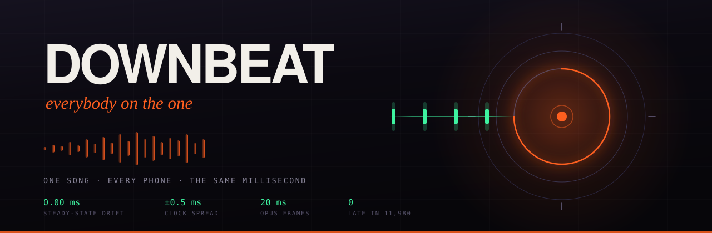

[](https://developers.cloudflare.com/containers/)
[](source/)
[](#7-how-the-synchronisation-works)
[](#7-how-the-synchronisation-works)
[](LICENSE)

**Play Spotify on every phone in the room, on the same millisecond.**

Deploy Downbeat to your own Cloudflare account, connect your own Spotify
account once, and a device called **“Downbeat”** appears under Devices in your
Spotify app — anywhere in the world, on any of your devices. Press play on it,
and every phone that scanned your room's QR code becomes a speaker, all of
them on the same instant, and they stay there for hours.

No app, no account for guests, no computer running at the party. The host's
"hardware" is a Rust process in a Cloudflare container; the host's console is
a web page; the guests' player is a browser tab.

## 1. Isn't this just a Spotify Jam?

A Jam is the feature everyone reaches for, and as a shared queue it's fine.
But it has one structural gap: **the devices don't play together.** A Jam
plays on one output, and when guests "listen along" on their own devices,
each phone streams and buffers independently — playback lands up to a second
apart, one phone echoing the next. Laying five phones around a room and
getting one big speaker out of them is precisely the thing a Jam cannot do,
because it streams at playback time and hopes; nothing in it ever makes two
devices agree on *when*.

And before the first note, there's the joining itself: proximity pairing —
Bluetooth device discovery that finds the session at one party and silently
doesn't at the next, guests waving phones at each other while someone
re-shares the invite link.

Downbeat is built for exactly that gap:

| | Spotify Jam | Downbeat |
| --- | --- | --- |
| Shared control of the music | ✓ | ✓ — you keep using Spotify itself |
| Every phone actually plays | listen-along, up to ~1 s apart | ✓ — the entire point |
| Devices in sync | never promised, audibly not | millisecond-locked, and it holds for hours |
| Joining | proximity pairing, works when it feels like it | a QR code and a six-letter room code — a URL, so it works every single time |
| Guests need | the Spotify app + an account (Premium to listen along) | a browser tab |

The inversion that makes it work: audio arrives on every phone well
**before** its deadline, so what the network delivers late has already been
played from a buffer that never ran dry. All that has to agree across the
room is a clock — and clocks can be made to agree to a fraction of a
millisecond ([§7](#7-how-the-synchronisation-works)).

## 2. A night, from the host's side

1. Open `https://your-deployment/host`, unlock with your passphrase.
2. **Connect Spotify** — once, ever. The connection survives restarts.
3. **Open a room** — a six-letter code and a QR code appear.
4. **Start streaming** — a librespot container boots in Cloudflare's cloud
   and registers as a Spotify Connect device under your account.
5. On your phone: Spotify → Devices → **Downbeat** → play.

Guests scan the QR, tap once (browsers refuse to start audio without a
gesture), and are in sync. The console shows every connected device live:
round-trip time, clock confidence, buffer health, and the actual inter-device
spread in milliseconds.

## 3. Architecture

```text
      your Spotify app (phone, laptop, anywhere)
                 │  Spotify Connect — remote control only
                 ▼
   ┌──────────────────────────────┐
   │  downbeat-source (Rust)      │   Cloudflare Container
   │  · librespot Connect device  │   started per room by its
   │  · decodes in-process        │   Durable Object, scale-to-zero
   │  · 44.1 → 48 kHz, Opus      │
   │  · stamps every 20 ms frame  │
   └──────────────┬───────────────┘
                  │  Opus over WebSocket, ~110 kbit/s
                  ▼
   ┌──────────────────────────────┐    D1: sessions, tokens (encrypted)
   │  RoomDO (Durable Object)     │    R2: uploaded tracks (file mode)
   │  · WebSocket hub             │    Cron: hourly sweep
   │  · TIME SERVER               │
   │  · live relay (tagged)       │
   └──────────────┬───────────────┘
                  │
     ┌────────────┼────────────┐
     ▼            ▼            ▼
   iPhone       iPad        laptop      each: AudioWorklet reading a
                                        SharedArrayBuffer ring, indexed
                                        by absolute stream sample
```

| path | contents |
| --- | --- |
| `source/` | the cloud source: librespot as a library, resampler, Opus, room clock, health port |
| `src/worker/index.ts` | router, sessions, host tokens, R2 range serving, cron sweep |
| `src/worker/spotify.ts` | server-side OAuth (PKCE), encrypted refresh-token store, source tokens |
| `src/worker/source-container.ts` | per-room container supervisor: start, stop, status, crash restarts |
| `src/worker/room-do.ts` | Durable Object: WS hub, time server, arm barrier, live relay |
| `src/audio/clock.ts` | room clock — Cristian's algorithm, min-RTT filtering, slew |
| `src/audio/engine.ts` | decode-ahead playback, drift control, live player |
| `public/live-processor.js` | AudioWorklet reading the shared-memory ring |
| `src/ui/` | the door, the room, the host console |
| `migrations/` | D1 schema |

## 4. Deploy your own

Downbeat is not a hosted service and has no central anything. Each deployment
is one person's: your Cloudflare account, your Spotify account, your rooms.

**You need:**

- A **Cloudflare account** on the [Workers Paid plan](https://developers.cloudflare.com/workers/platform/pricing/)
  ($5/month — Containers require it; see [§5](#5-what-it-costs) for what the
  free plan can and cannot do).
- A **Spotify Premium** account (Spotify Connect refuses to play on free
  accounts). No developer app, no API keys — none of that exists here.
- Node 20+, Docker running (the audio source deploys as a container image).

**Then:**

```bash
git clone https://github.com/luka-loehr/downbeat && cd downbeat
./scripts/setup.sh
```

The script creates the bucket and database on your account, wires the ids,
prompts for the two secrets, and deploys. Then open
`https://<your-worker-domain>/host`, unlock, and **connect Spotify**: approve
in the tab that opens, and paste back the address of the dead `127.0.0.1`
page Spotify strands you on — that address carries the authorization code,
and the console finishes the exchange server-side. Once, ever.

Every later deploy is just `npx wrangler deploy`. Pushing to `main` deploys
automatically if you add `CLOUDFLARE_API_TOKEN` and `CLOUDFLARE_ACCOUNT_ID`
to your GitHub repository's Actions secrets.

> The secrets, for reference: `HOST_PASSPHRASE` (unlocks your console) and
> `TOKEN_KEY` (32 random bytes, base64 — encrypts the stored Spotify refresh
> token so a leaked database hands out nothing usable).

## 5. What it costs

| | **Free plan** | **Workers Paid — $5/month** |
| --- | --- | --- |
| Rooms, sync, guest playback | ✓ | ✓ |
| File mode (upload tracks, play in sync) | ✓ for small parties | ✓ |
| **Spotify cloud source** | ✗ — Containers require Paid | ✓ |
| Workers requests | 100k/day | 10M/month included |
| Durable Objects | ✓ (SQLite-backed), 100k req/day | 1M req/month included |
| D1 / R2 | 5 GB / 10 GB free | same free allowances |
| Containers | not available | 25 GiB-hours memory, 375 vCPU-minutes, 200 GB-hours disk included monthly |

What a real night uses: the source runs on a **basic** instance (1 GiB, ¼
vCPU). A four-hour party consumes ~4 GiB-hours of the 25 included, ~60 of the
375 included vCPU-minutes, and a fraction of a gigabyte of transfer. **Several
parties a month fit inside the $5 with nothing left over to pay.** The
container scales to zero when you stop it (or when the room dies), and the
supervisor refuses to restart a container whose credentials have expired, so
nothing idles on your bill.

## 6. Security & legal shape

- **Single operator, by design.** Only the person holding `HOST_PASSPHRASE`
  can connect a Spotify account — this is not, and is deliberately not
  built to be, a multi-tenant service where strangers log in. You stream
  your own account, on your own deployment, to your own party.
- **There is no client secret anywhere.** Spotify auth is Authorization
  Code + PKCE as a public client — the same flow librespot itself uses,
  against the same client id, because Spotify Connect's login5 endpoint
  accepts no other (Web-API developer-app tokens are refused outright; we
  measured). The refresh token is stored AES-GCM-encrypted under a key that
  exists only as a Worker secret; the container receives only hour-lived
  access tokens, fetched on demand.
- The PKCE state/verifier are held server-side, each state consumable
  exactly once.
- Host and source roles are granted only against an HMAC-signed token that
  is *also* checked against the session on record — a signature alone cannot
  be revoked, so the database is the authority.
- Audio is decoded in RAM and streamed; nothing is written to disk, nothing
  is stored, nothing can be downloaded. Don't run this as a public service;
  it is built for your own living room, and the licenses on your account
  reach exactly that far.

## 7. How the synchronisation works

**The clock.** Each client — and the source container, running the same
algorithm in Rust — probes the Durable Object over its WebSocket: send `t0`,
the DO replies `t1`, the client stamps `t2`.

```
offset = t1 − (t0 + t2) / 2        rtt = t2 − t0
```

Only probes close to the fastest round trip are believed — a slow round trip
has more room to hide the path asymmetry Cristian's algorithm cannot see. The
estimate is stepped during the opening burst and slewed afterwards. Two things
make this work on Cloudflare specifically: Workers freeze `Date.now()`
between I/O as a Spectre mitigation, and in a WebSocket handler the message
arrival *is* that I/O — so the timestamp is fresh exactly when it is taken as
the handler's first statement. And a shared clock error cancels: if the DO is
40 ms from UTC, every device is 40 ms from UTC together, and they still agree
with each other.

**The stream.** The source stamps every 20 ms Opus frame with a room-clock
play deadline and an absolute sample index. The deadline anchors the stream
once; the sample index is what receivers actually place by, so packet
placement is contiguous *by construction* — the room→context clock mapping
never sits in the signal path where its sub-millisecond corrections would
round to one-sample holes fifty times a second.

**The output.** Decoded audio is written into a **SharedArrayBuffer ring read
directly by the AudioWorklet** on the realtime audio thread: no copies, no
message ports, main-thread jank physically cannot stutter playback (pages are
served cross-origin isolated to make that legal). A PI controller nudges each
device's playback rate by at most 0.3 % — about five cents of pitch, applied
as a ramp — to hold its output against the room clock, which is how devices
with crystals 100 ppm apart stay put for ten hours.

**The budget.** The delay between Spotify and the room's speakers is not a
constant: every member continuously reports the worst cushion its ring
actually had, and the source steers the delay budget toward the smallest
value the room's weakest listener can carry — growing immediately when anyone
gets close to the edge, shrinking by slow creep when the whole room has slack,
and slewing every adjustment so no packet ever jumps.

## 8. What this deliberately does not do

- **No Web Playback SDK, no developer app, no API streaming.** Spotify's
  Web API brings quota caps and app reviews for a flow that, in the end,
  cannot even drive a Connect device (login5 refuses its tokens). The audio
  path is Spotify Connect via librespot, authorized the way librespot
  authorizes, under your own Premium account.
- **No multi-tenant hosting.** One deployment, one operator, one Spotify
  account. Anything else is a different product with different legal weather.
- **No WebRTC.** It minimises latency and tolerates drift, resampling
  independently per peer — precisely the wrong trade. Downbeat accepts a
  fixed delay and guarantees identical playout instants.
- **No player controls for guests.** A joined phone is a speaker, not a
  remote; every control is a way for one device to end up out of step.
- **No claim of acoustic perfection.** Sound travels 34 cm per millisecond;
  two speakers three metres apart are ~9 ms apart at your ear no matter what
  software does. Downbeat removes the software error; the room is the room.

## 9. Working on it

```bash
npm run typecheck        # worker + web
npm test                 # clock estimator, drift controller, room codes
npm run build

cd source
cargo check --locked     # the Rust source (lockfile pins a vergen family that builds)
docker build .           # what wrangler deploy ships
```

Local Worker development: `npx wrangler dev` (containers run locally through
Docker). CI typechecks, tests and builds both halves on every push; pushes to
`main` deploy.

## 10. License

[MIT](LICENSE). Downbeat carries audio your own accounts and devices are
already entitled to play, to speakers in the same room. What you point it at
is your responsibility, not the software's.
